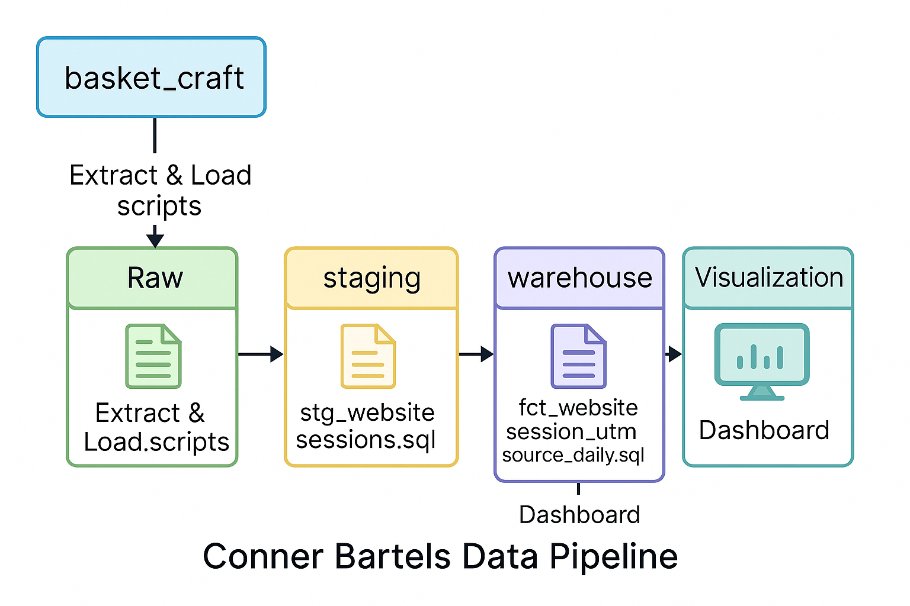

# Website Sessions Data Pipeline

This project implements a complete ELT pipeline for `website_sessions` data from December 2023. The data is extracted from a MySQL source named `basket_craft` using Python and SQLAlchemy, then loaded into a Postgres `raw` schema. Using dbt, the data is transformed through staging and warehouse models into a daily session summary with UTM source attribution. The pipeline is automated using GitHub Actions and Secrets, and results are visualized in an interactive Looker Studio dashboard. This project mirrors real-world data workflows.

---

## Data Pipeline Diagram

---

## Technologies Used

| Layer        | Tools & Technologies |
|--------------|----------------------|
| **Source**   | AWS RDS MySQL |
| **Raw**      | Python, Pandas, SQLAlchemy |
| **Staging**  | dbt |
| **Warehouse**| dbt |
| **Automation** | GitHub Actions, GitHub Secrets |
| **Dashboard**| Looker Studio |
| **Version Control** | Git & GitHub |

---

## Dashboard

Click here to view the Looker Studio Dashboard
[(dbt_basket_craft/SQL%20Quiz%203%20Visualization.pdf)](https://lookerstudio.google.com/reporting/7297299d-6761-472d-9943-d3fdfb49c50d)

